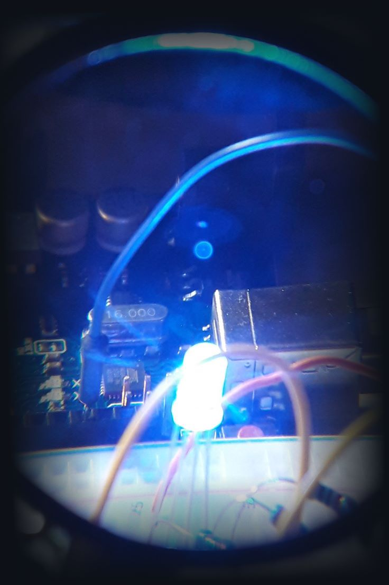

  

|  Country |       Age       | Operating System | Sports |
|:--------:|:---------------:|:---------:|:---------:|
| Portugal | ~(currentYear-2000) | Ubuntu / Windows (for gaming) | Gym / Armwrestling / Box |

- In Github, I like to share and document my knowledge in programming, computer usage, media editing, programming projects & other things 💡
- I did a Computer Science and Computer Engineering BSc course in [ISEL](https://www.isel.pt/en/curso/10514/plano-de-estudos) 🎓
- I'm now on a journey of self-learning of various programming topics & media creation, while looking forward to make the most out of my life 🙏

<h3 align="center" >My experience </h3>

  
|    Editors & Tools   | Frameworks & Libraries | Environments & Databases | Media Editing & Creation |   AI & ML  |
|:--------------------:|:----------------------:|:------------------------:|:------------------------:|:----------:|
|    Jetbrains IDEs    |         Spring           |          Docker            |         Vegas Pro          | Media Pipe   |
|    Android Studio      |          React           |         Firebase           |    Adobe After Effects     |            |
|  Visual Studio Code    |         Express          |       Google Cloud         |         Paint.NET          |            |
| Git / Github Desktop   |         Compose          |       Azure Cloud          |           GIMP             |            |
|        Postman         |          Koin            |        PostgreSQL          |         FL Studio           |            |
|       Virtual Box    |                        |       Elasticsearch        |         Audacity           |            |
|                      |                        |          NodeJS            |                          |            |

    
    
    

________
### A litle more about my work
- I explain things with as many detail as reasonably possible. My motto around here is "Most things, aren't hard, they're just not well explained". After what I've personally been through, this motto is true. I want to ease the learning of concepts through easy explanations and examples
- My repos consist of:
	1. Personal or college projects
	2. Repos that explain topics or programming languages. In the more educational/explanatory repos, I tend to group topics that make sense to group, in order to not create a bunch of repos with overlapping topics.
- Open issues in the repositories if you want to better contact me
- Feel free to do a pull request or notify me if I said something that is false, or have a program that doesn't work or that could be better designed in my repos

<h3 align="center"><i><ins>Checkout my best projects bellow!</i></ins> 👇</h3>
